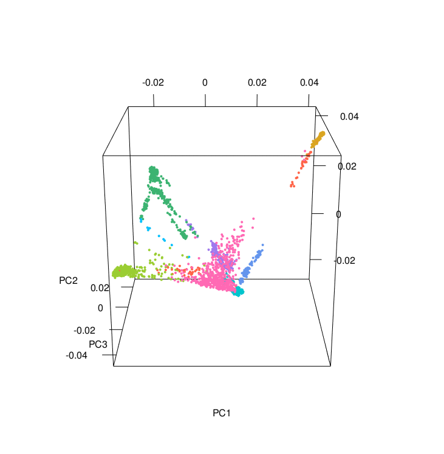

**The Admixture and Neurodegeneration Genomic Landscape (TANGL) Study**  
**This repository contains a series of scripts developed for the analyses of identity by descent (IBD) in a three-way admixed population from Colombia.** 
[](https://zenodo.org/badge/latestdoi/394373254)

We are provinding examples of the scripts we used at every step of the analyses we presented in our paper "A Neurodegenerative Disease Landscape of Rare Mutations in Colombia Due to Founder Effects". 

  If you use our scripts, please cite: \
  Acosta-Uribe, J., Aguillón, D., Cochran, J.N. et al. A neurodegenerative disease landscape of rare mutations in Colombia due to founder effects. Genome Med 14, 27 (2022). https://doi.org/10.1186/s13073-022-01035-9


**Pipeline**

1. Identify relatedness between samples using KING
2. Principal Component Analysis (PCA) using PLINK and EIGENSOFT
3. Estimation of global ancestry using ADMIXTURE
4. Phasing genomes using SHAPEIT2
5. Local ancestry inference using RFMix 
6. Identification of Identitical by Descent (IBD) segments using Hap-IBD

________
The TANGL dataset comprised both *related* and *unrelated* individuals. Having related individuals in the same dataset improves **Phasing** and **IBD** detection.\
However, certain analyses such as PCA or ADMIXTURE need to be performed in unrelated individuals. If you know your dataset contains related individuals, I recommend doing some additional quality control steps using PLINK 1.9 [http://www.cog-genomics.org/plink2]().

First, edit your file.fam to reflect the Paternal and Maternal ID for each sample, and give each known family, the same Family ID (first column of file.fam).
If the father or the mother is in the dataset, their Sample ID needs to match the Father or Mother ID of their offspring.
Once your <file>.fam reflects known relationships, check your file for "mendel errors"
  
Set mendel errors to missing, (this will be useful for the phasing steps as well)
```
plink --bfile <file-prefix> --mendel-duos --set-me-missing  --make-bed --out <file-prefix>.me
  
plink --bfile <file-prefix>.me --mendel-multigen --set-me-missing  --make-bed --out <file-prefix>.me.multigen
``` 
  

**1. Identify relatedness between samples**

We used KING to verify diclosed relationships (e.g. parent-offsping, full-siblings etc)[https://www.kingrelatedness.com/manual.shtml]() \
Ideally, the relatedness coefficient should match the disclosed relationship.  

A subset of unrelated samples was selected by keeping only the proband of each family. Once we extracted a single individual per family, we performed another check for criptic relatedness. Only sample pairs with kinship coefficient less than 0.044 should be retained 
 
```
king -b <file-prefix>.bed --related --degree 3
```


**2. Principal Component Analysis (PCA)**

For PCA, we used the subset of unrelated samples and performed LD-pruning using PLINK to exclude variants with an r2 value of greater than 0.2 with any other SNP within a 50-SNP sliding window, advancing by 10 SNPs each time. Then, we performed a PCA using the smartpca package from EIGENSOFT(v7.2.1) [https://github.com/DReichLab/EIG/archive/v7.2.1.tar.gz]. You can open the script [PCA_with_MAF_restrictions.sh](PCA_with_MAF_restrictions.sh) in any text editor and set the minor allele frequency (MAF) thresholds you want for your analyses. 

  ```
  chmod u+x PCA_with_MAF_restrictions.sh
  ```
  ```
  ./PCA_with_MAF_restrictions.sh
  ```

The PCA results colored according to ancestry were plotted using the PCAviz package for R, take a look at the R markdown [RunningPCAviz.Rmd](RunningPCAviz.Rmd)\
You can also make nice PCA images and a 3D PCA using the R script [3D_PCA.R](3D_PCA.R)  
 / ! [](3dAnimatedScatterplot.gif)  
  
  
**3. Estimation of global ancestry using ADMIXTURE**

We calculated global ancestry using ADMIXTURE (v.1.3.0) [https://dalexander.github.io/admixture/]() with the same LD-prunned dataset we generated for the PCA.
A shell script is provided in [ADMIXTURE.sh](ADMIXTURE.sh). This script performes an unsupervised analysis modeling from one to ten ancestral populations (K = 1 – 10) using the random seed option and replicating each calculation 20 times. We selected the run with the best Loglikehood value for each K and compared the Cross Validation (cv) error values to determine the model with the lowest cv value. 
  ```
  chmod u+x ADMIXTURE.sh
  ```
  ```
  ./ADMIXTURE.sh
  ```

 
**4. Phasing genomes using SHAPEIT2**

The best phasing results were obtained by pahsing our TANGL dataset along with the European, African and Native american genomes, and using the haplotype reference panel of the 1000GP. We used SHAPEIT (v.2.r900)[https://mathgen.stats.ox.ac.uk/genetics_software/shapeit/shapeit.html]()
  
Since we have multiple related individuals, we used the parameters –duohmm and a window of 5MB (-W 5), which takes advantage of the inclusion of families, pedigree structure and the large amount of IBD shared by close relatives, leading to increased accuracy. 

Here is a markdown of Phasing with Shapeit2
[Phasing Tutorial](Phasing.md)

  
**5. Identification of Identitical by Descent (IBD) segments using Hap-IBD**

If any of the disease-conferring or risk-associated variants were shared by two or more unrelated individuals, we used hap-IBD v1.0 to search for identity by descent (IBD) around the locus. This software detects IBD of 2cM and highers. Hap-IBD can also detect Autozygosity (homozygosity by descent). [https://github.com/browning-lab/hap-ibd]()

Here is a markdown of detecting IBD with Hap-IBD
[Run_Hap-IBD.md](Run_Hap-IBD.md)

And a series of Python scripts to plot overlapping IBD segments over a locus of interest  
 
**6. Local ancestry inference using RFMix**

We implemented protocols similar to those previously developed for ancestry estimation in admixed populations. \
We recommend the following repository to identify local ancestry [https://github.com/armartin/ancestry_pipeline.git]()

To determine the carrier haplotype and local ancestry of a rare variant of interest, we used PLINK to identify other single nucleotide variants (SNVs) in linkage disequilibrium with the variant of interest. Then, we used these tags to identify the carrier haplotypes in the phased dataset, and searched for the local ancestry of the specific locus in the RFMix output.

 
